# Week 6 — AppSec Findings to SOC Visibility

This lab connects application-security testing in GitHub Actions to SOC monitoring and response. Semgrep and pip-audit produce JSON findings, the findings are manually transferred and normalized on a Linux endpoint, Wazuh classifies them as Level 12 alerts, and the existing Week 5 Shuffle workflow delivers analyst-ready notifications to Slack.

The final verified state intentionally contrasts two controls:

- **Semgrep is red by design** because the training SQL injection remains in `app.py`.
- **pip-audit is green** because the controlled vulnerable dependency was remediated to Flask `3.1.3`.

## Training safety notice

> [!WARNING]
> This is an intentionally vulnerable training application. It contains a deliberate SQL injection and training-only hardcoded credentials. Do not deploy it to the public internet or reuse its authentication pattern, secret, database query construction, or sample credentials in a real system.

The app was exposed on `0.0.0.0:5000` only inside an isolated lab network for validation. Internal `192.168.244.x` addresses visible in evidence are lab-only. Public evidence excludes the two source screenshots that reveal the training secret and password.

## Objectives and success criteria

The Week 6 objective was to prove a complete, accurately bounded path from developer feedback to SOC action:

- Build and validate the SecureOps Flask training application.
- Run Semgrep and pip-audit as independent GitHub Actions jobs.
- Preserve JSON artifacts even when a security control fails.
- Keep the deliberate SQL injection so Semgrep blocks the build as intended.
- Test a controlled vulnerable dependency with Flask `3.0.3` and advisory `PYSEC-2026-2151`.
- Restore Flask `3.1.3` and verify that pip-audit reports no known vulnerabilities.
- Ingest normalized Semgrep and pip-audit events into Wazuh.
- Classify the findings with Rules `100202` and `100203` at Level 12.
- Deliver both alerts through Shuffle to Slack.
- Stop AppSec Rules `100202` and `100203` before the unrelated VirusTotal hash-enrichment branch.

## Final architecture

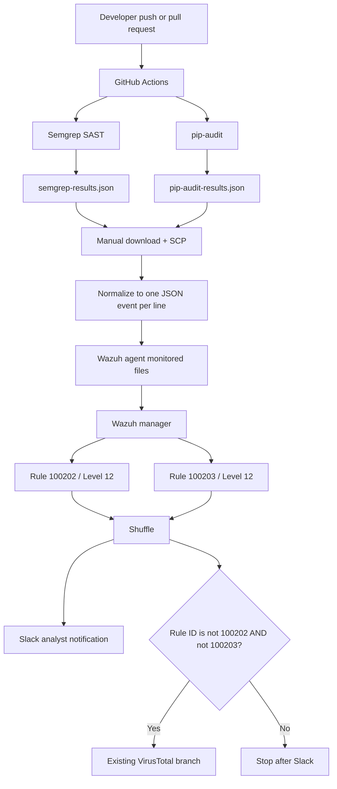

The GitHub-to-endpoint handoff was **not automated**. Artifacts were downloaded manually, transferred with SCP, normalized, and replayed into monitored files. Automation was live from Wazuh onward. See [architecture/README.md](architecture/README.md) for the trust boundary and data flow.

## SecureOps application

SecureOps is a small Flask employee portal with a landing page, authenticated dashboard, and employee directory. The directory search deliberately concatenates user input into SQL so the lab has a persistent SAST finding to detect, route, and investigate.

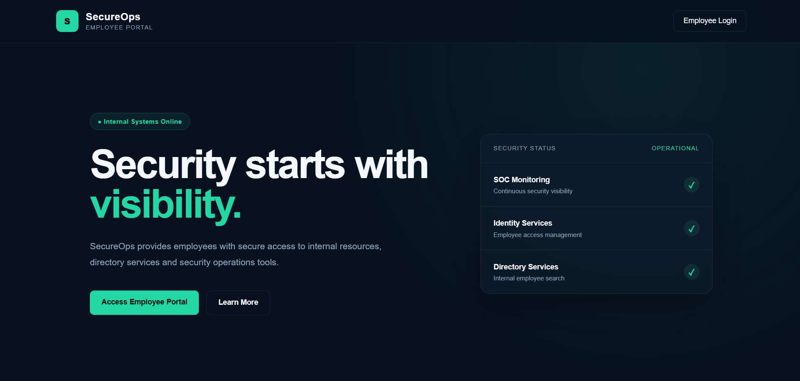

_SecureOps landing page running inside the isolated lab._

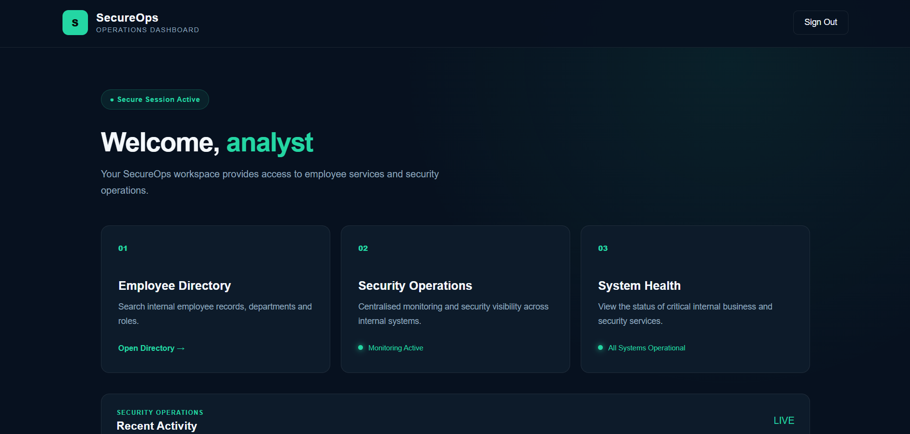

_Authenticated dashboard proving that the training workflow is usable._

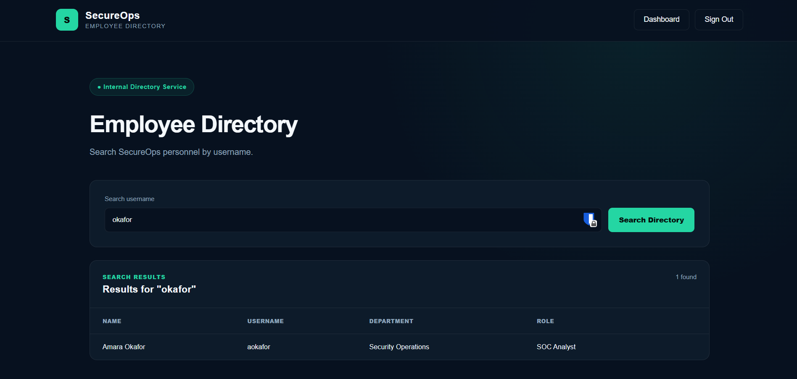

_Directory search result exercising the deliberately unsafe code path._

## GitHub Actions design

The workflow contains two independent jobs:

| Job | Purpose | Final outcome |
| --- | --- | --- |
| `semgrep` | SAST, JSON export, artifact upload, then blocking gate | Red by design |
| `dependency-scan` | Dependency audit, JSON export, artifact upload with `if: always()` | Green |

The ordering is important. Semgrep first exports `semgrep-results.json` and uploads `semgrep-security-findings`; only then does a second scan run with `--error` to enforce the blocking gate. pip-audit likewise exports `pip-audit-results.json`, while `if: always()` preserves whatever result file is available for investigation.

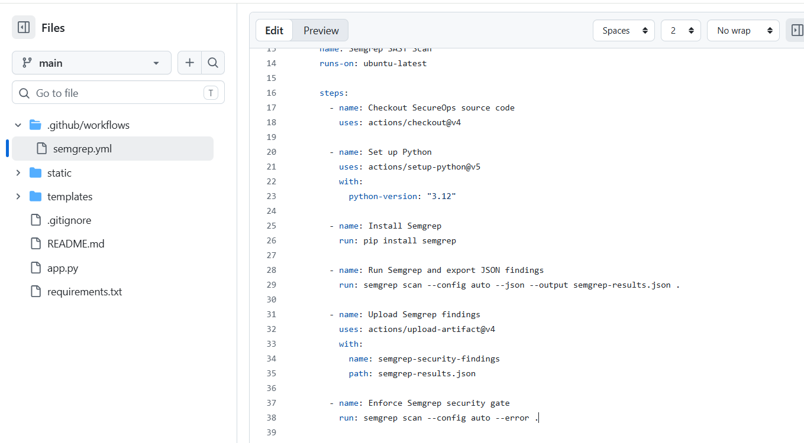

_Semgrep JSON export and artifact upload occur before the blocking `--error` gate._

The checked-in workflow is documented in [documentation/setup.md](documentation/setup.md). No workflow or application source change is proposed in this documentation update.

## Semgrep: expected red security gate

The final Semgrep run produced **6 findings, all 6 blocking, from 341 rules across 11 targets**, and exited with code `1`. This is the expected control outcome: the SQL injection remains deliberately present for training.

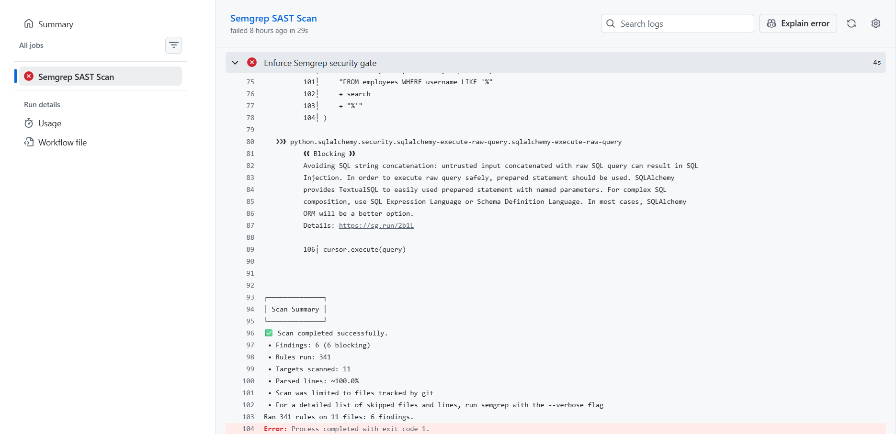

_Final Semgrep metrics: 6 findings, 6 blocking, 341 rules, 11 targets, exit code 1._

The artifact remained available despite the failed gate:

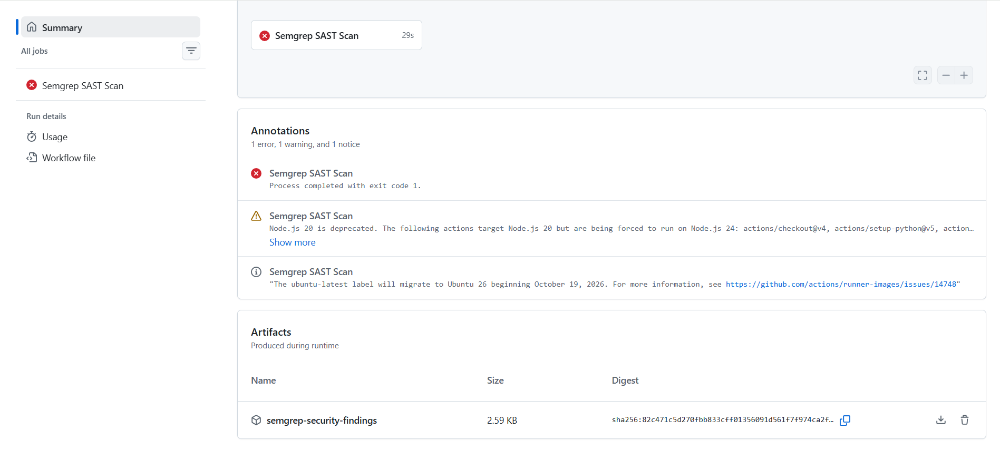

_`semgrep-security-findings` was produced before the job failed._

## Wazuh ingestion: Semgrep and Rule 100202

The exported Semgrep array was converted to one JSON object per line and written to `/var/log/semgrep/findings.json`. Wazuh monitored that file with `log_format` set to `json`.

File replacement was not detected reliably during testing, so replay used a truncate-and-append pattern rather than replacing the monitored file. The working rule family matched the decoded top-level `source=semgrep` field directly:

- `100200`: Semgrep parent event.
- `100201`: Semgrep error-severity child.
- `100202`: Semgrep SQL-injection child, Level 12.

The earlier `decoded_as json` approach fell through to generic Rule `1002`; it is retained only as troubleshooting evidence and is not presented as the final configuration.

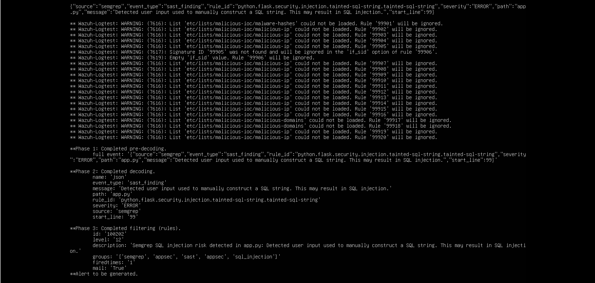

_`wazuh-logtest` reaches Rule `100202`, Level 12, and generates an alert._

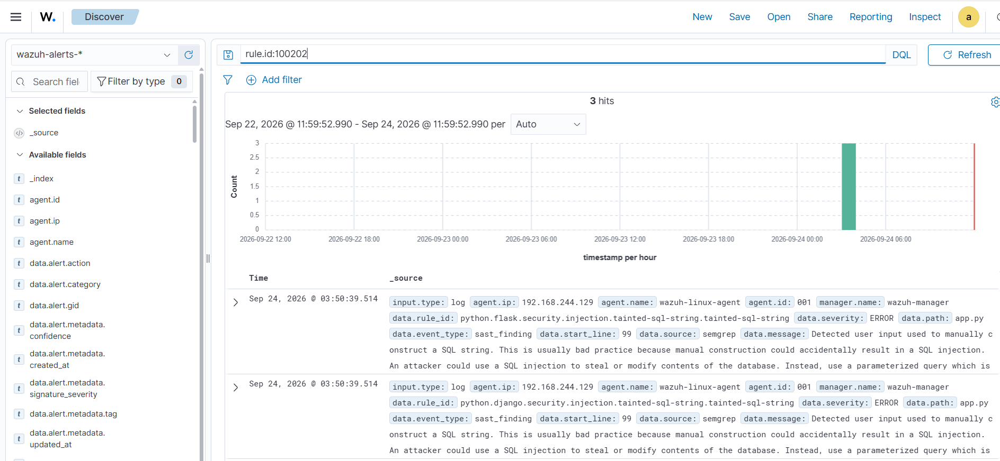

_Wazuh dashboard query `rule.id:100202` returning three verified hits._

The exact tested design is explained in [documentation/wazuh-integration.md](documentation/wazuh-integration.md).

## Controlled pip-audit test and remediation

Flask `3.0.3` was introduced temporarily to prove dependency-vulnerability detection. pip-audit identified `PYSEC-2026-2151` and reported Flask `3.1.3` as the fix version.

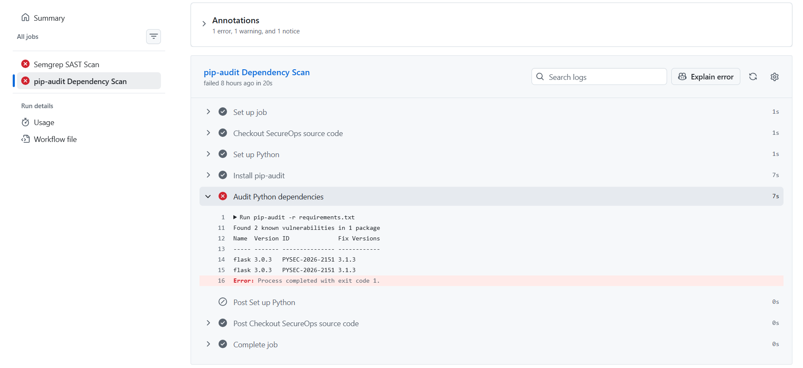

_Controlled test: Flask `3.0.3`, advisory `PYSEC-2026-2151`, fix version `3.1.3`._

The dependency was then restored:

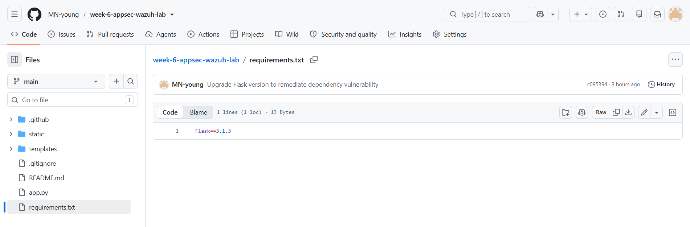

_Final `requirements.txt` state: Flask `3.1.3`._

The remediated job returned the intended clean result:

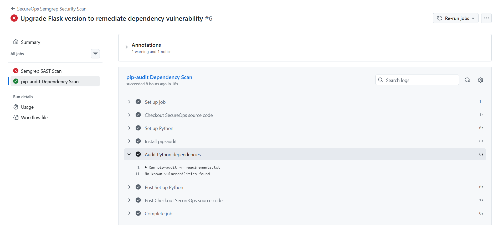

_Final pip-audit result: “No known vulnerabilities found.”_

## Wazuh ingestion: pip-audit and Rule 100203

The native pip-audit output was normalized into one dependency event per line. The built-in Wazuh JSON decoder exposed the required fields, so no custom decoder was necessary. Duplicate normalized records were not byte-for-byte identical; the controlled replay explicitly retained the first event with `head -n 1`.

Rule `100203` matched `source=pip-audit` plus `event_type=dependency_vulnerability` and classified the dependency finding at Level 12.

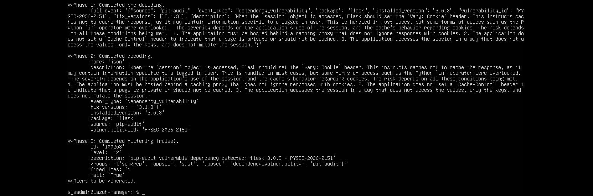

_`wazuh-logtest` reaches Rule `100203`, Level 12, for Flask `3.0.3` and `PYSEC-2026-2151`._

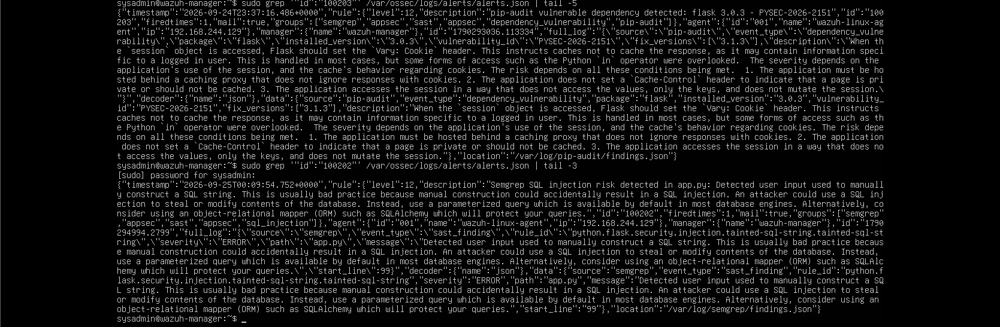

_Live Wazuh alert evidence for Rules `100202` and `100203`._

## Shuffle and Slack routing

The existing Week 5 Shuffle workflow delivered both Week 6 AppSec alerts to Slack. Initially, those alerts also entered the VirusTotal branch, which produced irrelevant `404` / no-record messages because AppSec findings are not file-hash investigations.

The final design keeps Slack delivery first and adds two exclusions immediately afterward:

```text
$exec.rule_id != 100202
AND
$exec.rule_id != 100203
```

This placement lets the analyst receive the alert while preventing unnecessary VirusTotal enrichment. Putting the condition before Slack would suppress the desired notification.

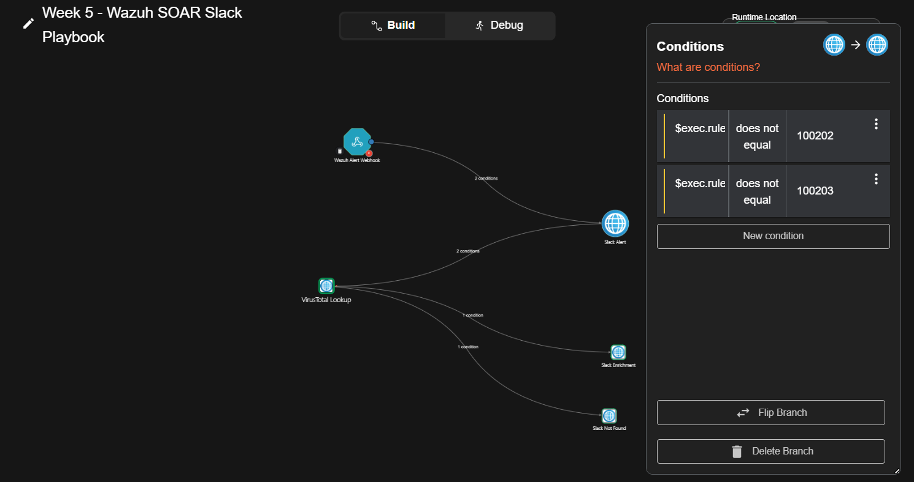

_Rules `100202` and `100203` are excluded after Slack and before VirusTotal._

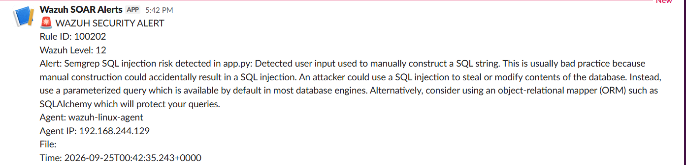

_Clean Semgrep SQL-injection alert: Rule `100202`, Level 12._

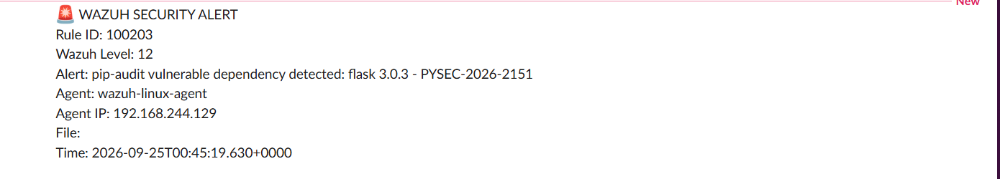

_Clean pip-audit dependency alert: Rule `100203`, Level 12._

The abandoned dynamic pip-audit Slack formatter is documented only as troubleshooting; nested `$exec` and `fix_versions.#0` references failed and are not part of the final workflow. See [documentation/soar-routing.md](documentation/soar-routing.md).

## Troubleshooting highlights

The clean final path depended on preserving several failed or intermediate states:

- Python venv creation initially failed because `python3.12-venv` / `ensurepip` was missing.
- A stale `apt` process with PID `8651` held the package-manager lock; that specific process was inspected and terminated before recovery.
- Flask initially listened only on `127.0.0.1`; it was rerun with `--host 0.0.0.0 --port 5000` inside the isolated lab.
- SSH was inactive and disabled; the service was started and enabled.
- SCP was first run from the wrong system; the Windows path had to be used from Windows PowerShell.
- The first Semgrep workflow found issues but stayed green; adding `--error` made it an intentional blocking gate.
- Monitored-file replacement was unreliable; truncate plus `tee -a` produced a detectable replay.
- `archives.json` was not enabled, so validation used `alerts.json` and `wazuh-logtest`.
- Broad grep patterns produced false matches; exact source and rule-ID searches were used.
- The first Semgrep rule design fell through to generic Rule `1002`; direct top-level field matching fixed it.
- Unrelated Rule `7616` list warnings appeared while `wazuh-analysisd -t` still returned `0`.
- pip-audit job YAML had duplication and indentation problems while the stretch goal was added.
- Byte-for-byte deduplication did not remove duplicate pip-audit events; the replay retained the first line explicitly.
- The pre-fix Shuffle route sent AppSec events to VirusTotal and produced irrelevant no-record messages.
- The wrong Shuffle connector was nearly edited; the correct fix was the branch condition after Slack.
- A dedicated dynamic pip-audit formatter experiment failed and was abandoned.
- VM watchdog soft-lockup messages were observed; no root cause is claimed.

Full commands, symptoms, and resolutions are in [documentation/troubleshooting.md](documentation/troubleshooting.md). Pre-fix and failed-state images remain in `evidence/troubleshooting/` and are clearly separated from final-state proof.

## Final known-good state

| Control | Verified final state |
| --- | --- |
| Application | Training-only Flask app; deliberate SQL injection remains |
| Semgrep | 6 findings / 6 blocking / 341 rules / 11 targets / exit `1` |
| Semgrep artifact | Uploaded before the blocking gate failed |
| Dependency | Flask `3.1.3` |
| pip-audit | No known vulnerabilities found |
| Controlled vulnerable test | Flask `3.0.3`, `PYSEC-2026-2151` |
| Wazuh Semgrep alert | Rule `100202`, Level 12, logtest + live alert + dashboard verified |
| Wazuh dependency alert | Rule `100203`, Level 12, logtest + live alert verified |
| SOAR delivery | Both alerts delivered through Shuffle to Slack |
| VirusTotal route | Rules `100202` and `100203` excluded after Slack |

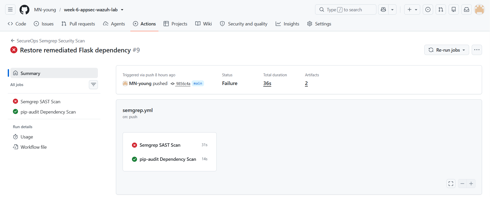

_Final CI contrast: Semgrep red as the expected blocking control; pip-audit green after remediation._

The completion record is in [validation/completion-checklist.md](validation/completion-checklist.md) and [validation/final-state.md](validation/final-state.md).

## Reflection: unifying AppSec and SOC visibility

Week 6 demonstrated that application-security findings do not need to remain isolated inside CI/CD. Semgrep gave developers pre-deployment feedback about insecure code, while pip-audit identified dependency risk. Wazuh brought both classes of finding into the SOC's existing monitoring environment, and Shuffle plus Slack made high-severity findings actionable for analysts.

The routing correction was as important as detection: application-security alerts should reach analysts without being forced through an unrelated file-hash enrichment path. This creates a stronger shared workflow in which developers receive fast security feedback and SOC analysts gain application-risk visibility beside endpoint and infrastructure alerts.

See [documentation/reflection.md](documentation/reflection.md) for the full reflection.

## Evidence gallery

The README intentionally uses 17 strong screenshots rather than every capture. All 127 safe, unique screenshots are organized by implementation stage under [`evidence/`](evidence/README.md):

- `application/` — repository creation and SecureOps build proof.
- `github-actions/` — workflow evolution and job-state evidence.
- `semgrep/` — findings, gate metrics, and artifact preservation.
- `wazuh-100202/` — Semgrep normalization, rule development, logtest, live alert, and dashboard.
- `pip-audit/` — dependency test, artifact, normalization, and remediation evidence.
- `wazuh-100203/` — agent collection, decoder fields, rule validation, and live alerts.
- `shuffle-slack/` — final exclusions and clean Slack notifications.
- `troubleshooting/` — failed and intermediate states, including pre-fix VirusTotal routing.
- `final-state/` — Flask `3.1.3`, clean pip-audit, and the final CI contrast.

Two raw source screenshots were deliberately withheld because they expose the training secret and password. Duplicate screenshots were deduplicated. The evidence manifest is in [evidence/README.md](evidence/README.md).

## Limitations and future improvements

- Artifact delivery from GitHub Actions to the Linux endpoint is manual. A future design could use an authenticated artifact collector or controlled runner, while preserving integrity checks and least privilege.
- The lab uses replayed JSON files rather than a production ingestion pipeline.
- The application is intentionally insecure and is not a deployment reference.
- The Semgrep gate intentionally remains red until the training SQL injection is remediated in a future exercise.
- Before any public update, rotate or revoke any Slack incoming webhook, VirusTotal API key, or Shuffle secret that appeared during the lab, even though those values are not included in this evidence set.

## Repository map

```text
.
├── .github/workflows/semgrep.yml
├── README.md
├── app.py
├── architecture/README.md
├── documentation/
│   ├── reflection.md
│   ├── setup.md
│   ├── soar-routing.md
│   ├── troubleshooting.md
│   └── wazuh-integration.md
├── evidence/
│   ├── README.md
│   ├── application/
│   ├── final-state/
│   ├── github-actions/
│   ├── pip-audit/
│   ├── semgrep/
│   ├── shuffle-slack/
│   ├── troubleshooting/
│   ├── wazuh-100202/
│   └── wazuh-100203/
├── requirements.txt
├── static/
├── templates/
└── validation/
    ├── completion-checklist.md
    └── final-state.md
```
