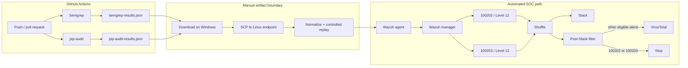

# Architecture and trust boundaries

## Verified data flow

## Boundary statement

The pipeline was automated inside GitHub Actions and again from Wazuh onward. The bridge between those systems was manual:

1. Download the GitHub Actions JSON artifact.
2. Run SCP from Windows PowerShell because the source path is a Windows path.
3. Normalize the JSON on the Linux endpoint into one complete object per line.
4. Replay the event into the monitored file with truncate plus append.

This repository does not claim an automatic GitHub-to-Wazuh collector.

## Components

| Component | Role | Output or decision |
| --- | --- | --- |
| GitHub Actions | CI/CD execution | Independent Semgrep and pip-audit jobs |
| Semgrep | Static analysis | `semgrep-results.json`; blocking exit `1` |
| pip-audit | Dependency analysis | `pip-audit-results.json`; clean after remediation |
| SCP + normalization | Manual handoff | One JSON event per line |
| Wazuh agent | File collection | Monitors Semgrep and pip-audit feeds |
| Wazuh manager | Decode and classify | Rules `100202` and `100203`, Level 12 |
| Shuffle | SOAR routing | Slack first; AppSec exclusions before VirusTotal |
| Slack | Analyst notification | High-severity AppSec alert visible to the SOC |

## Security properties

- JSON artifacts are preserved before a job can fail.
- The deliberate Semgrep finding remains visible as an expected red gate.
- The dependency test is temporary; final source pins Flask `3.1.3`.
- Wazuh receives structured events, not screenshots or prose.
- AppSec alerts reach Slack but do not enter irrelevant file-hash enrichment.
- Public evidence excludes credentials, webhook URLs, API keys, and tokens.

## Future-state improvement

A production version could replace the manual boundary with a least-privilege artifact collector, integrity validation, secure secret storage, and an authenticated delivery channel. That improvement is not part of the verified Week 6 implementation.
